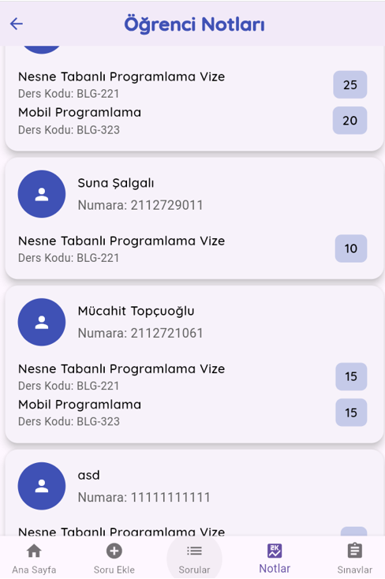
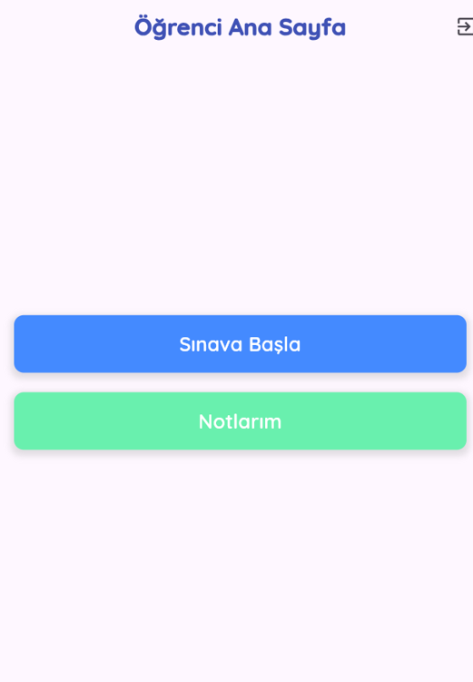

# Sınav Yönetim Sistemi

Bu proje, öğretmenlerin sınav oluşturup yönetebileceği ve öğrencilerin bu sınavlara katılabileceği bir Flutter uygulamasıdır. Firebase Authentication ve Cloud Firestore kullanılarak geliştirilmiştir.

## Özellikler

### Öğretmen Paneli
- Soru bankası oluşturma ve yönetme
- Sınav oluşturma
- Öğrenci notlarını görüntüleme
- Sınavlara soru ekleme/çıkarma
- Ders kodlarına göre soru filtreleme

### Öğrenci Paneli
- Sınavlara katılma
- Anlık sınav puanı görüntüleme
- Geçmiş sınav sonuçlarını görüntüleme
- Zamanlı sınav sistemi

## Ekran Görüntüleri

# Ekran Görüntüleri

## Giriş Ekranları
<p float="left">
  
  
</p>

## Öğretmen Paneli
<p float="left">
  
  
  
  
</p>

## Öğrenci Paneli
<p float="left">
  
  
</p>

## Teknolojiler

- Flutter
- Firebase Authentication
- Cloud Firestore
- Google Fonts

## Kurulum

1. Projeyi klonlayın
```bash
git clone https://github.com/mucahit-topcuoglu/Flutter-Firebase-Sinav-Otomasyonu.git

2. Bağımlılıkları yükleyin
```bash
flutter pub get
```

3. Firebase yapılandırmasını gerçekleştirin
- Firebase Console'dan yeni bir proje oluşturun
- Flutter uygulamanız için Firebase yapılandırma dosyalarını indirin
- `google-services.json` (Android) ve `GoogleService-Info.plist` (iOS) dosyalarını projenize ekleyin

4. Uygulamayı çalıştırın
```bash
flutter run
```

## Katkıda Bulunma

1. Bu depoyu fork edin
2. Yeni bir özellik dalı oluşturun (`git checkout -b feature/AmazingFeature`)
3. Değişikliklerinizi commit edin (`git commit -m 'Add some AmazingFeature'`)
4. Dalınıza push yapın (`git push origin feature/AmazingFeature`)
5. Bir Pull Request oluşturun


## İletişim

mmucahittopcuoglu@gmail.com

Proje Linki: https://github.com/mucahit-topcuoglu/Flutter-Firebase-Sinav-Otomasyonu
